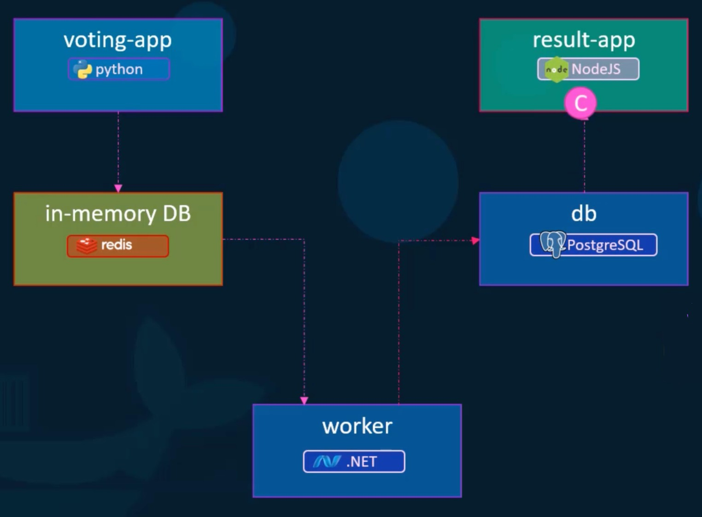
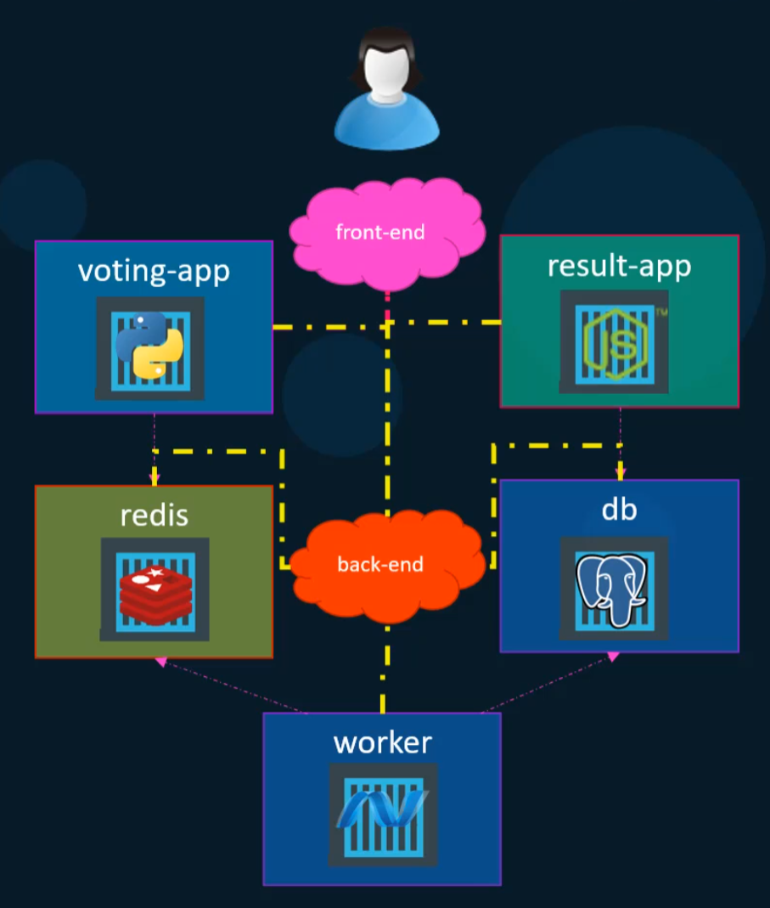

# Course: Docker Training Course for the Absolute Beginner

## Basic Commands

### Run a Container from an Image

* `docker run <image>`
* `docker run <image> <command>`
* `docker run -d <image>`
* `docker run -d --name <name> <image>`

### Run commands in a Container

* `docker exec -it <container> <command>`
  - Example: `docker exec -it my_container bash`

### Attach to a Running Container

* `docker attach <container>`

### Stop a Container

* `docker stop <container>`

### Remove a Container

* `docker rm <container>`

### List Containers

* `docker ps`
  - Lists running containers only.
* `docker ps -a`
  - Lists all containers

### List Images

* `docker images`

### Remove Images

* `docker rmi <image>`

### Pull an Image

* `docker pull <image>`
  - Only pulls the image, it does not run it.

## Docker Run

### Run a Container from an Image specifying a Tag

* `docker run <image>:<tag>`
  - The default tag is "latest"
  - Example: `docker run nginx:1.19` runs the nginx image with the tag 1.19.

### Run a Container interactively

* `docker run -it <image>`
  - Runs a container interactively with a terminal attached.
  - `-i`: interactive, redirects the STDIN for the terminal to the container
  - `-t`: terminal, attaches the terminal to the container to receive the STDOUT

### Run a Container and remove it after it stops

* `docker run --rm <image>`
  - Automatically removes the container when it stops.
  - Useful for one-off tasks or scripts.

### Port Mapping

* `docker run -p <host_port>:<container_port> <image>`
  - Maps a port on the host to a port on the container.
  - Example: `docker run -p 8080:80 nginx` maps port 8080 on the host to port 80 on the nginx container.

### Volume Mapping

* `docker run -v <host_path>:<container_path> <image>`
  - Maps a directory on the host to a directory in the container.
  - This is useful for persisting data or sharing data between the host and the container.
  - Example: `docker run -v /opt/data:/var/lib/mysql mysql` maps `/opt/data` on the host to `/var/lib/mysql` in the MySQL container.

### Inspect a Container

* `docker inspect <container>`
  - Displays detailed information about a container in JSON format.
  - Useful for debugging and understanding the configuration of a container.

### Container Logs

* `docker logs <container>`
  - Displays the logs of a container.
  - Useful for debugging and monitoring the output of a container.

## Docker Images

Before starting, list the steps it would take to manually deploy the application without Docker. Then, create a `Dockerfile` that automates those steps.

For example, for a simple Flask application, the manual steps might include:

1. VM running Ubuntu
2. Update apt repo
3. Install dependencies using apt
4. Install Python and dependencies using pip
5. Copy the source code the the `/opt` directory
6. Run the web server using the `flask` command

To create a Docker image, first create the `Dockerfile`:

```Dockerfile
FROM ubuntu

# Update apt repo
RUN apt-get update

# Install dependencies using apt
RUN apt-get install -y python3 python3-pip

# Install Python dependencies using pip
COPY requirements.txt /opt/
RUN pip3 install -r /opt/requirements.txt

# Copy the source code the the /opt directory
COPY . /opt/source-code

# Run the web server using the flask command
ENTRYPOINT FLASK_APP=/opt/source-code/app.py flask run
```

Then, build the image using the `docker build` command:

```bash
docker build -f Dockerfile -t my_flask_app .
```
This command builds the Docker image (locally) and tags it as `my_flask_app`.

To make it available to others, you can push it to a Docker registry like Docker Hub:

```bash
docker tag my_flask_app myusername/my_flask_app:latest
docker push myusername/my_flask_app:latest
```

Finally, run a container from the image:

```bash
docker run -d -p 5000:5000 my_flask_app
```
This command runs the container in detached mode and maps port 5000 on the host to port 5000 in the container.

### Environment Variables

Export a variable in the host:

```bash
export FLASK_ENV=dev
```

Pass the variable to the container:

```bash
docker run -d -p 5000:5000 -e FLASK_ENV my_flask_app
```

 To find the environment variables in a running container, inspect it and check the ``Env`` array:

```bash
docker inspect <container_id> | grep Env -A 10
```

### Commands vs Entrypoint

#### CMD

`CMD` specifies the default command to run when the container starts. It can be overridden by providing a different command when running the container. It's usually placed at the end of the `Dockerfile` and defined as an array of strings.

* Example:
  ```Dockerfile
  CMD ["sleep", "5"]
  ```
  * If run with `docker run <image>`, it will execute `sleep 5`.
  * If run with `docker run <image> sleep 10`, it will execute `sleep 10` instead.

#### ENTRYPOINT

`ENTRYPOINT` specifies a command that will always run when the container starts. It cannot be overridden by providing a different command when running the container. It's usually placed at the end of the `Dockerfile` and defined as an array of strings.

* Example 1:
  ```Dockerfile
  ENTRYPOINT ["sleep", "5"]
  ```
  * If run with `docker run <image>`, it will execute `sleep 5`.
  * If run with `docker run <image> sleep 10`, it will still execute `sleep 5`.

* To override the `ENTRYPOINT`, use the `--entrypoint` flag when running the container:
  ```bash
  docker run --entrypoint echo <image> 10
  ```
  * It will execute `echo 10`.

* Example 2:
  ```Dockerfile
  ENTRYPOINT ["sleep"]
  ```
  * If run with `docker run <image>`, it will result in an error because no argument is provided to `sleep`.
  * If run with `docker run <image> 10`, it will execute `sleep 10`.

* Note: If you use `ENTRYPOINT`, it's a good practice to also use `CMD` to provide default arguments that can be overridden (see below).

#### Using both CMD and ENTRYPOINT

If both `CMD` and `ENTRYPOINT` are specified, the `CMD` will be passed as arguments to the `ENTRYPOINT`.

* Example:
  ```Dockerfile
  FROM ubuntu
  ENTRYPOINT ["sleep"]
  CMD ["5"]
  ```
   * If run with `docker run <image>`, it will execute `sleep 5`.
   * If run with `docker run <image> 10`, it will execute `sleep 10`.

## Docker Compose

The `docker-compose.yml` is a docker configuration file in YAML format. It defines the necessary configuration to run a Docker application.

Example:

```yml
services:
  web:
    image: "honna/simple-webapp"
  database:
    image: "mongodb"
  messaging:
    image: "redis:alpine"
  orchestration:
    imagem: "ansible"
```

Then, to start the services defined in the `docker-compose.yml` file, run:

```bash
docker compose up
```

The image below shows the architecture of a sample voting application with five components:

<div align="center">
  
</div>

First, to run these containers individually, it would be necessary to:

```bash
docker run -d --name=redis redis
docker run -d --name=db postgres
docker run -d --name=vote -p 5000:80 voting-app
docker run -d --name=result -p 5001:80 result-app
docker run -d --name=worker worker
```

This would run the containers, but it wouldn't link them together. That means that they won't be able to communicate with one another and the application (as a whole) would not work.

### Linking Containers

Back in the day, we used the `--link` flag to link containers together:

```bash
docker run -d --name=redis redis
docker run -d --name=db postgres
docker run -d --name=vote -p 5000:80 --link redis:redis voting-app
docker run -d --name=result -p 5001:80 --link db:db result-app
docker run -d --name=worker --link db:db --link redis:redis worker
```

But that's now DEPRECATED.

Then, it evolved to Docker Compose v1, where the links could be specified in a `docker-compose.yml` file:

```yml
redis:
  image: redis
db:
  image: postgres:9.4
vote:
  image: voting-app # Or build: ./vote (if it's local code and not an image)
  ports:
    - 5000:80
  links:
   - redis
result:
  image: result-app # Or build: ./result
  ports:
    - 5001:80
  links:
    - db
worker:
  image: worker # Or build: ./worker
  links:
    - db
    - redis
```

NOTE: `db:db` = `db`

But then Docker Compose also evolved (v2, v3...) and now uses a different approach for networking and service discovery, making it easier to manage multi-container applications without the need for explicit links.

In Docker Compose v2 and later, all containers are automatically connected to a default bridged network, and they can communicate with each other using their service names as hostnames.

It also introduces the concept of "depends_on", which allows you to specify dependencies between services.

NOTE: In the most recent version of Docker Compose, the version does not have to be specified in the first line of the `docker-compose.yml` file.

So, the previous example can be rewritten to:

```yml
services:
  redis:
    image: redis
  db:
    image: postgres:9.4
  vote:
    image: voting-app # Or build: ./vote (if it's local code and not an image)
    ports:
      - 5000:80
    depends_on:
      - redis
  result:
    image: result-app # Or build: ./result
    ports:
      - 5001:80
  worker:
    image: worker # Or build: ./worker
```

### Networks in Docker Compose

However, if we want to create separate networks, for example, to separate user-generated traffic from the apps' internal traffic, we can define custom networks in the `docker-compose.yml` file:

<div align="center">
  
</div>

* front-end network:
  * voting-app
  * result-app

* back-end network:
  * voting-app
  * result-app
  * redis
  * db
  * worker

```yml
services:
  redis:
    image: redis
    networks:
      - back-end
  db:
    image: postgres:9.4
    environment:
      POSTGRES_USER: postgres
      POSTGRES_PASSWORD: postgres
    networks:
      - back-end
  vote:
    image: voting-app # Or build: ./vote (if it's local code and not an image)
    ports:
      - 5000:80
    depends_on:
      - redis
    networks:
      - front-end
      - back-end
  result:
    image: result-app # Or build: ./result
    ports:
      - 5001:80
    networks:
      - front-end
      - back-end
  worker:
    image: worker # Or build: ./worker
    networks:
      - back-end
networks:
  front-end:
  back-end:
```

## Docker Engine

The Docker Engine is the core component of Docker, responsible for building, running, and managing containers. It consists of a server (the Docker daemon), a REST API, and a command-line interface (CLI) for interacting with the daemon.

Na CLI, é possível executar comandos especificando o host:

```bash
docker -H ssh://root@172.16.1.143 ps
```

Docker uses namespaces to isolate the workspaces.

Processes inside docker containers run using the same resources as the underlying host. There is no default resource limits for containers. But it can be specified using control groups (cgroups) configured by the flags:

### Limit CPU

```bash
docker run -d --name=my_container --cpus=".5" my_image
```
The container will not use more than 50% of the available CPU at any given time.

### Limit Memory

```bash
docker run -d --name=my_container --memory="256m" my_image
```
The container will not use more than 256MB of memory at any given time.

## Docker Storage

Docker files live inside the `/var/lib/docker` directory on the host machine. This directory contains all the images, containers, volumes, and other data managed by Docker. It's important to note that this directory is managed by Docker, and users should not modify its contents directly.

Docker uses a layered architecture. That is, for each command in the Dockerfile, a new layer is created. Each layer is read-only, except for the top layer, which is writable.

When a new Dockerfile is created, Docker will try to reuse the cached layers from previous builds. This means that if a layer hasn't changed, Docker can use the cached version instead of rebuilding it, which speeds up the build process and saves disk space.

The image layers are read-only. When you run a container from an image, a new writable layer is added on top of the image layers (all containers running from an image share the same image layers). Any changes made to the container (like creating files, installing software, etc.) are stored in this writable layer. When a container is destroyed, this writable layer is also destroyed.

To persist data from a container, you can use Docker volumes. Volumes are stored outside the container's filesystem and can be shared between containers. This means that even if a container is destroyed, the data in the volume remains intact.

```bash
docker volume create my_volume
```

This will create a volume under: `/var/lib/docker/volumes/my_volume`

Then, it can be mounted inside the container when running it:

```bash
docker run -d --name=my_container -v my_volume:/data my_image
```

This is called **volume mounting**.

NOTE: If a volume is not yet created, Docker will automatically create a new volume for you when you run a container with the `-v` flag.

To use data store at a different location, you can specify the host path when creating the volume:

```bash
docker run -d --name=my_container -v /host/path:/data my_image
```

This is called **bind mounting**.

IMPORTANT: Using the `-v` is the old way of doing things.

A more explicit way of defining volumes is by using the `--mount` flag and the specifying the options:

```bash
docker run -d --name=my_container \
--mount type=volume,source=my_volume,target=/data my_image
```

or

```bash
docker run -d --name=my_container \
--mount type=bind,source=/host/path,target=/data my_image
```

## Docker Networking

Docker creates three networks automatically:

* `bridge`
  * Default
  * Usually assigns IPs in the range 172.17.0.0/16
  * Containers can access each other using their IP addresses
* `none`
  * Containers are not attached to any network, they run isolated
* `host`
  * This removes the isolation between the container and the host (for example, running an app in a container in port 5000 will automatically expose it in the host's network without port mapping)

By default, a container is attached to the `bridge` network.

To connect it to a different network, you can use the `--network` flag:

```bash
docker run --network=none my_image
docker run --network=host my_image
```

You can create your own network using the `docker network create` command:

```bash
docker network create     \
  --driver bridge         \
  --subnet 182.18.0.0/16  \
  --gateway 182.18.0.1    \
  custom_isolated_network
```

Then, you can connect your containers to this network:

```bash
docker run --network=custom_isolated_network my_image
```

To inspect a running container, use the `docker inspect` command:

```bash
docker inspect <container_id>
```

This will provide detailed information about the container, including its network settings, mounted volumes, and more.

All containers in a docker network can resolve each other using their container names as hostnames.

To list the existing networks:

```bash
docker network ls
```

To inspect a network:

```bash
docker network inspect <network_name>
```
